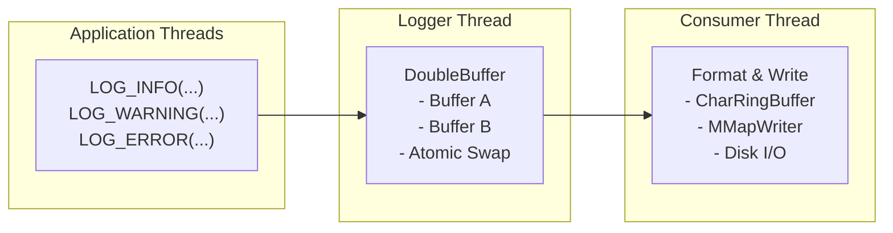
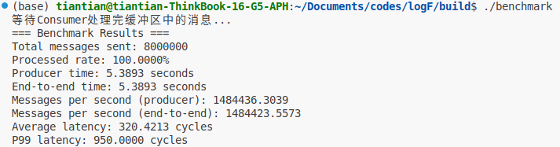
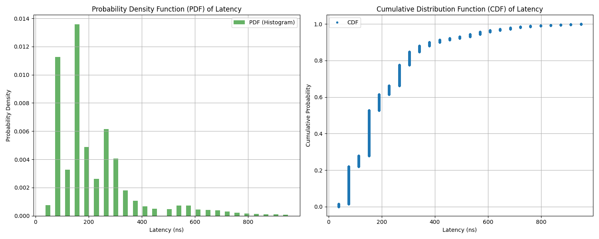

# LogF - 基于C++17的高性能日志库

一个专为高频交易、游戏引擎等低延迟场景设计的C++17高性能异步日志库。

## ✨ 特性

- **超低延迟**: 前端平均307个CPU周期，P99延迟950个周期
- **高吞吐量**: 写入性能达150k msg/sec
- **无锁设计**: 基于原子操作的双缓冲区实现
- **类型安全**: 编译期类型检查，运行时高效访问，支持三个可变参数
- **线程安全**: 支持多生产者单消费者模式
- **简单依赖**： 不需要第三方库支持

## 🏗️ 设计思想

### 核心理念

LogF的设计遵循"**前端极速，后端异步**"的核心理念：

1. **前端优先**: 最小化日志调用对业务线程的影响，低延迟优先
2. **后端处理**: 将格式化和文件IO操作放在后端进行


### 性能优化策略

- **无锁缓存**: 前后端之间的双缓冲区完全由原子变量控制读写，消费者完成消费后交换
- **结构体优化**: LogMessage 64字节，对齐cache
- **内存预分配**: 堆上内存在日志开始前已经分配完成，热路径上没有分配
- **内存效率**: 紧凑的数据结构设计，提高缓存效率
- **零拷贝**: 避免不必要的内存拷贝和系统调用
- **时间优化**: 线程本地时间缓存，消除时区转换开销
- **内存对齐**: 64字节对齐的原子变量，避免false sharing


## 🏛️ 设计架构



### 关键组件

#### 1. LogMessage (64字节)

```cpp
struct LogMessage {
    std::chrono::system_clock::time_point timestamp;  // 8字节
    const char* file;                                 // 8字节  
    std::string_view format;                          // 16字节
    std::array<LogVariant, 3> args;                   // 27+1字节
    uint16_t line;                                    // 2字节
    uint8_t level;                                    // 1字节
    uint8_t num_args;                                 // 1字节
};
```

#### 2. DoubleBuffer (无锁双缓冲)

- **生产者**: 写入当前活跃缓冲区
- **消费者**: 处理非活跃缓冲区
- **原子交换**: 使用单一原子变量同时表示活跃缓冲区ID和计数器，使用CAS交换避免竞态

#### 3. LogVariant (紧凑变体类型)

```cpp
struct LogVariant {  // 9字节 (使用__attribute__((packed)))
    union {
        int32_t i;
        double d;
        const char* s;
    } data;      // 8字节
    Type type;   // 1字节
};
```

#### 4. Consumer Pipeline

- **异步处理**: 独立线程处理格式化和I/O
- **内存映射**: 零拷贝文件写入
- **批量刷新**: 减少系统调用次数


## 📖 使用示例

### 基本用法

```cpp
#include "../include/logger.h"
#include "../include/consumer.h"

int main() {
    // 创建8KB双缓冲区
    logF::DoubleBuffer double_buffer(1024 * 8);
    logF::Logger logger(double_buffer);
    logF::Consumer consumer(double_buffer, "logs");
    
    // 启动消费者线程
    consumer.start();
    
    // 日志记录
    LOG_INFO(logger, "Application started");
    LOG_WARNING(logger, "User % logged in from %", "admin", "192.168.1.1");
    LOG_ERROR(logger, "Database connection failed: code %", 500);
    
    // 程序结束时清理
    consumer.stop();
    return 0;
}
```

### 多线程环境

```cpp
#include "../include/logger.h"
#include "../include/consumer.h"
#include <thread>
#include <vector>

void worker_thread(logF::Logger& logger, int thread_id) {
    for (int i = 0; i < 1000000; ++i) {
        LOG_INFO(logger, "Thread % processing item %", thread_id, i);
    }
}

int main() {
    logF::DoubleBuffer double_buffer(1024 * 1024 * 64);  // 64MB缓冲区
    logF::Logger logger(double_buffer);
    logF::Consumer consumer(double_buffer, "logs");
    
    consumer.start();
    
    // 启动多个工作线程
    std::vector<std::thread> threads;
    for (int i = 0; i < 4; ++i) {
        threads.emplace_back(worker_thread, std::ref(logger), i);
    }
    
    // 等待所有线程完成
    for (auto& t : threads) {
        t.join();
    }
    
    consumer.stop();
    return 0;
}
```

## ⚡ 性能基准

### 测试环境

- **CPU**: AMD 7840H
- **OS**: Ubuntu 24.02
- **编译器**: GCC 11+ / Clang 12+
- **编译选项**: `-O3 -std=c++17`
- **测试场景**: 8线程 × 100k消息/线程

### 性能指标

| 指标 | 数值 | 备注 |
|------|------|------|
| **前端延迟 (平均)** | 307 CPU周期 | ~80ns @ 3.7GHz |
| **前端延迟 (P99)** | 950 CPU周期 | ~265ns @ 3.7GHz |
| **吞吐量** | 150k msg/sec | 整个系统的写入速度 |
| **内存占用** | 64 字节/消息 | LogMessage结构大小 |

### benchmark



### 延迟分布


## 🔧 编译和安装

### 系统要求

- **C++17** 兼容编译器
- **CMake 3.10+**
- **Linux/macOS** (支持mmap)

### 编译步骤

```bash
git clone https://github.com/your-username/logF.git
cd logF
mkdir build && cd build
cmake ..
make -j$(nproc)
```

### 运行测试

```bash
# 基本功能测试
./example

# 性能基准测试
./benchmark
```

## 🎯 适用场景

### 最佳适用场景

- **高频交易系统**: 对延迟极度敏感
- **游戏引擎**: 实时渲染中的调试日志
- **网络服务器**: 高并发请求日志
- **实时系统**: 工业控制、嵌入式系统

### 不适用场景

- **低频日志**: 每秒<1000条消息的场景
- **复杂格式化**: 需要复杂字符串操作，参数多于三个
- **同步写入**: 要求日志立即落盘
